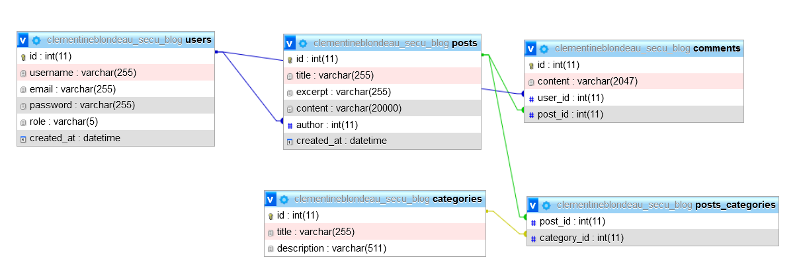

# bre01-blog-secu

The is a demo blog project that demonstrates how to patch SQL, XSS, strong auth and CSRF security concerns. The blog is in PHP using MVC design pattern and OOP.

## Étape 1 : les fichiers

Vous trouverez les fichiers du projet dans l’archive secu-blog.zip ici. Parcourez ces fichiers, vous verrez qu’une partie des contenus vous sont déjà fournis. À vous de compléter le reste.

## Étape 2 : base de données

Sur PhpMyAdmin, créez une base de données prenomnom_secu_blog (en utf8_general_ci) et importez-y les fichiers SQL que vous trouverez ici dans l’ordre suivant :

    categories.sql
    users.sql
    posts.sql
    posts_categories.sql
    comments.sql

# Étape 3 : les models

Faites en sorte que vos modèles soient conformes à ce qui est présent dans votre base de données. Vous devrez utiliser la composition pour représenter les jointures (par exemple, un Post a, entre autres, une Category et un User en attribut). La table posts_categories est une pure table de liaison, elle n’a donc pas de modèle.|

```Js

 //  1. Analyser la structure de la BDD et les relations entre les tables. Regarder le concepteur
 //  2. Créer des classes dans models pour chaque table sauf post_categories, les attributs correspondent aux colonnes (+ regarder les types)
 //  3. Mettre des getters et des setters pour chaque attribut
 //  4. Tester les instances


```



## Étape 4 : les Managers

Vous allez devoir créer les managers vous permettant de manipuler votre base de données. Attention, vous devez obligatoirement hydrater des instances de classes.

Voici les méthodes minimum que vous devez avoir dans vos Managers :
CategoryManager

    findAll() qui retourne toutes les catégories
    findOne(int $id) qui retourne la catégorie qui a l’id passé en paramètre, null si elle n’existe pas

### PostManager

    findLatest() qui retourne les 4 derniers posts
    findOne(int $id) qui retourne le post qui a l’id passé en paramètre, null si il n’existe pas
    findByCategory(int $categoryId) qui retourne les posts ayant la catégorie dont l’id est passé en paramètre

### CommentManager

    findByPost(int $postId) qui retourne les commentaires ayant le post dont l’id est passé en paramètre
    create(Comment $comment) qui insère le commentaire passé en paramètres dans la base de données

### UserManager

    findByEmail(string $email) qui retourne le user qui a l’email passé en paramètre, null si il n’existe pas
    create(User $user) qui insère l’utilisateur passé en paramètres dans la base de données

```Js

// 1. Créer un fichier .env et autoload Composer, adapter l'AbastractManager
// 2. Tester la connexion
// 3. Créer les Managers pour les catégories avec les méthodes données en sécurisant les requêtes grace à la variable $parameters
// 4. Tester les instances

```

## Étape 5 : les Controllers

Vous allez devoir utiliser vos controllers pour afficher le contenu de vos pages et gérer la soumission de vos formulaires. Attention, vous devez gérer la faille CSRF et la faille XSS pour toute information soumise par l’utilisateur.
Sécurité

Les mots de passe doivent faire 8 caractères au minimum, avec au moins une majuscule, une minuscule, un chiffre et un caractère spécial.

Vous allez devoir utiliser une expression régulière pour cela, mon conseil, demandez à ChatGPT (ou toute autre IA) de rédiger cette expression pour vous et de vous l’expliquer. Les expressions régulières sont une syntaxe à part entière d’où ce conseil. Vous avez un bref cours sur les Regex et leu usage en PHP ici : https://elearning.3wa.fr/mod/page/view.php?id=12370.

Les mots de passe doivent être chiffrés avec l’algorithme BCRYPT.

```Js

// 1.Analyser le routeur dans le dossier services et les noms de routes ainsi que leurs méthodes associées
// 2. Pour s'y retrouver, créer un tableau associatif avec les urls complets et leur méthode
// ex: index.php?route=home -> home() du BlogConcroller
// 3.Implémenter le layout avec la logique qui gère les routes en fonction du nom de route passé dans l'URL
// 4. Rajouter les liens dans les templates et tester que les routes affichent bien le bon template
// 5.Création des controlleurs et implémenter les méthodes. Point de vigileance sur la sécurité du AuthController


// AFFICHAGE:

index.php?route=home   -> home() du BlogController
index.php?route=register  -> register() du AuthController
index.php?route=login   -> login() du AuthController
index.php?route=post  -> post() du BlogController
index.php?route=category  -> post() du BlogController

// LOGIQUE:
index.php?route=check-register  -> checkRegister() du AuthController
index.php?route=check-login  -> CheckLogin() du AuthController
index.php?route=check-logout  -> logout() du AuthController
index.php?route=check-comment -> checkComment() du BlogController


```
